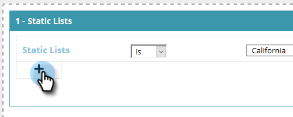

# Create a Segment Using a Static List {#create-a-segment-using-a-static-list}

Create a Segment Using a Static List - Marketo Docs - Product Documentation

Segment known web visitors when they visit your website based on if they're in or not in one of your Marketo [static lists](http://docs.marketo.com/display/DOCS/Understanding+Static+Lists).

##### 1. Go to Segments. {#createasegmentusingastaticlist-gotosegments.}

##### 2. Click Create New. {#createasegmentusingastaticlist-clickcreatenew.}

##### 3. Enter a segment Name. {#createasegmentusingastaticlist-enterasegmentname.}

##### 4. In Known Leads, drag Static Lists over to the canvas. {#createasegmentusingastaticlist-inknownleads-dragstaticlistsovertothecanvas.}

##### 5. Click the drop-down to select is or is not (depending on what you want), and type in the name of your static list. {#createasegmentusingastaticlist-fiveclickthedrop-downtoselectisorisnot(dependingonwhatyouwant)-andtypeinthenameofyourstaticlist.}

##### 6. If you want to add multiple lists, you need to create a new line for each one by clicking the +. If you only want one list, skip to [Step 8](#CreateaSegmentUsingaStaticList-eight). {#createasegmentusingastaticlist-ifyouwanttoaddmultiplelists-youneedtocreateanewlineforeachonebyclickingthe+.ifyouonlywantonelist-skiptostep8.}

##### 7. For multiple lists (or multiple "is not" lists), repeat the steps you learned in [Step 5](#CreateaSegmentUsingaStaticList-five). {#createasegmentusingastaticlist-formultiplelists(ormultiple"isnot"lists)-repeatthestepsyoulearnedinstep5.}

>[!NOTE]
>
>The and/or drop-down is just that. Click it to select **and**, **or**, or **and/or**.

##### 8. Click Save to save the segment or Save & Define Campaign to save and go to the Campaigns page. {#createasegmentusingastaticlist-eightclicksavetosavethesegmentorsave&definecampaigntosaveandgotothecampaignspage.}

