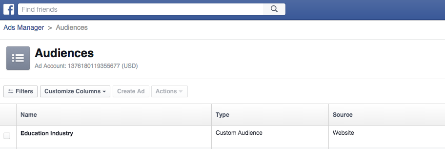
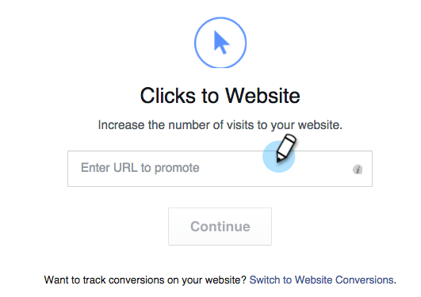

# Personalized Remarketing in Facebook {#personalized-remarketing-in-facebook}

Personalized Remarketing in Facebook - Marketo Docs - Product Documentation

### What's in this article? {#what-s-in-this-article}

[Creating an Audience in Facebook](#personalizedremarketinginfacebook-creatinganaudienceinfacebook)  
[RTP Data Points in Facebook](#personalizedremarketinginfacebook-rtpdatapointsinfacebook)  
[Target your Audience with an Ad](#personalizedremarketinginfacebook-targetyouraudiencewithanad)  
Personalized Remarketing lets you re-engage with your users using RTP Data and the power of Facebook Remarketing.

>[!NOTE]
>
>**Prerequisites**
>
>* Complete the [Retargeting with Web Personalization Data](retargeting-with-web-personalization-data.md) setup
>* Review the  [Facebook documentation on Custom Audiences](https://developers.facebook.com/docs/ads-for-websites/website-custom-audiences/getting-started#install-the-pixel)and Remarketing
>

#### Creating an Audience in Facebook {#personalizedremarketinginfacebook-creatinganaudienceinfacebook}

##### 1. In Facebook, go to your [Audience tab](https://www.facebook.com/ads/audience_manager) in Ads Manager. {#personalizedremarketinginfacebook-infacebook-gotoyouraudiencetabinadsmanager.}

##### 2. Click Tools and select Audiences. {#personalizedremarketinginfacebook-clicktoolsandselectaudiences.}

##### 3. Click Create a Custom Audience. {#personalizedremarketinginfacebook-clickcreateacustomaudience.}

##### 4. Select Website Traffic. {#personalizedremarketinginfacebook-selectwebsitetraffic.}

##### 5. In the Website traffic list, select Custom Combination. {#personalizedremarketinginfacebook-inthewebsitetrafficlist-selectcustomcombination.}

##### 6. In the Include list, select Event. {#personalizedremarketinginfacebook-intheincludelist-selectevent.}

##### 7. In the Event list, select RTP Remarketing and select a parameter. {#personalizedremarketinginfacebook-intheeventlist-selectrtpremarketingandselectaparameter.}

##### 8. For this example, select Industry to contain Education. Enter Education, and edit In the Last to be 180 days. Enter Audience Name: Education Industry. Click Create Audience. {#personalizedremarketinginfacebook-forthisexample-selectindustrytocontaineducation.entereducation-andeditinthelasttobe180days.enteraudiencename-educationindustry.clickcreateaudience.}

##### 9. You have now created a new custom audience using RTP data in Facebook. {#personalizedremarketinginfacebook-youhavenowcreatedanewcustomaudienceusingrtpdatainfacebook.}

#### RTP Data Points in Facebook {#personalizedremarketinginfacebook-rtpdatapointsinfacebook}

<table class="confluenceTable"> 
 <tbody> 
  <tr> 
   <th>Event Name</th> 
   <th> </th> 
  </tr> 
  <tr> 
   <td>RTP Remarketing</td> 
   <td> 
    
 
     <table class="confluenceTable"> 
      <tbody> 
       <tr> 
        <th>Parameter</th> 
        <th>Value</th> 
       </tr> 
       <tr> 
        <td>ABM List</td> 
        <td>(Name of Account-Based List)</td> 
       </tr> 
       <tr> 
        <td colspan="1">Category</td> 
        <td colspan="1">
Fortune 500

Fortune 1000

Global 2000
</td> 
       </tr> 
       <tr> 
        <td colspan="1">Group</td> 
        <td colspan="1">
Enterprise

SMB
</td> 
       </tr> 
       <tr> 
        <td>Industry</td> 
        <td>
Defense

Education

Financial Services

Government

Healthcare, Pharma, Biotech

Software and Internet

etc... (as per RTP Industry options)
</td> 
       </tr> 
       <tr> 
        <td colspan="1">Segmented Audience</td> 
        <td colspan="1">(Name of Segmented Audience created in RTP)</td> 
       </tr> 
      </tbody> 
     </table> 
    
</td> 
  </tr> 
 </tbody> 
</table>

#### Target your Audience with an Ad {#personalizedremarketinginfacebook-targetyouraudiencewithanad}

For additional details, see [Facebook's documentation](https://developers.facebook.com/docs/ads-for-websites/website-custom-audiences/getting-started#target-your-audience).

##### 1. Go to Ads Manager, Click Create Ad. {#personalizedremarketinginfacebook-gotoadsmanager-clickcreatead.}

##### 2. Select Send people to your website as the objective of your campaign. {#personalizedremarketinginfacebook-selectsendpeopletoyourwebsiteastheobjectiveofyourcampaign.}

` 

`

##### 3. Enter your website URL. {#personalizedremarketinginfacebook-enteryourwebsiteurl.}

##### 4. Create your ad set. Select a custom audience from the list of Audiences you created, for example, Education Industry. {#personalizedremarketinginfacebook-createyouradset.selectacustomaudiencefromthelistofaudiencesyoucreated-forexample-educationindustry.}

##### 5. Select all other ad set options, set your budget and define your ad creatives. {#personalizedremarketinginfacebook-selectallotheradsetoptions-setyourbudgetanddefineyouradcreatives.}

##### 6. You are now all set up with a personalized remarketing campaign in Facebook. {#personalizedremarketinginfacebook-youarenowallsetupwithapersonalizedremarketingcampaigninfacebook.}

>[!NOTE]
>
>**Related Articles**
>
>* [Retargeting with Web Personalization Data](retargeting-with-web-personalization-data.md)
>* [Personalized Remarketing in Google](personalized-remarketing-in-google.md)
>

`` 