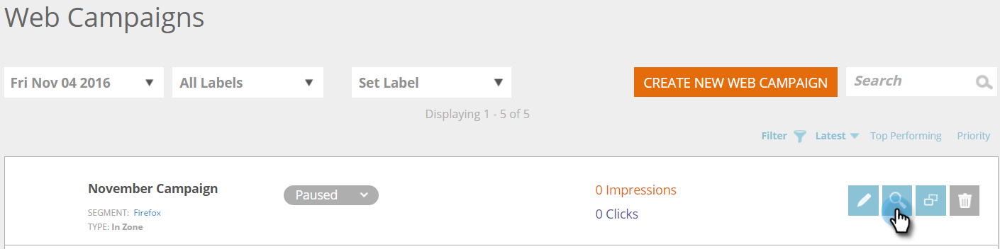

# Create a New In Zone Web Campaign {#create-a-new-in-zone-web-campaign}

Create a New In Zone Web Campaign - Marketo Docs - Product Documentation

### What's in this article? {#what-s-in-this-article}

[Create an In Zone Web Campaign](#createanewinzonewebcampaign-createaninzonewebcampaign)  
[Edit a Web Campaign](#createanewinzonewebcampaign-editawebcampaign)  
[Preview a Web Campaign](#createanewinzonewebcampaign-previewawebcampaign)  
[Clone a Web Campaign](#createanewinzonewebcampaign-cloneawebcampaign)  
[Delete a Web Campaign](#createanewinzonewebcampaign-deleteawebcampaign)  
A web campaign is a customized reaction associated with a specific segment and can be a [dialog box](create-a-new-dialog-web-campaign.md) on your website, an in zone replacement, a [widget feature](create-a-new-widget-web-campaign.md) or an email alert. `An In Zone web campaign replaces an element of your website based on the Zone id with content or graphical banners.`

#### Create an In Zone Web Campaign {#createanewinzonewebcampaign-createaninzonewebcampaign}

##### 1. Go to Web Campaigns. {#createanewinzonewebcampaign-gotowebcampaigns.}

##### 2. Select Create New Web Campaign.   
{#createanewinzonewebcampaign-selectcreatenewwebcampaign.}

3. Select the **In Zone** campaign type. Customize and add a **Zone id. **Set the campaign to **Sticky **and add your creative in the editor. Add the URL of the page to preview and click **Preview **to see how the campaign will react on your site.

>[!NOTE]
>
>**Definition**
>
>**What is a Zone ID?**
>
>A Zone ID is where you would like your "In Zone" web campaign to be located onsite. To find a "Zone ID", simply go to your website select the area you would like to replace with a web campaign and right-click. In Chrome, the option is “Inspect Element”, in other browsers it may vary.
>
>Then, you want to find the "id" associated with this section of the website, which is highlighted because you are inspecting that element. For example, if once you right-click in Chrome the highlighted text says 
 then "featured-slider" is what you should type in the "zone id" section. Typically "div id" is used, but any ID can be used as well, such as h1 id, p id, etc.

<table class="confluenceTable"> 
 <thead> 
  <tr> 
   <th colspan="1" rowspan="1">Name</th> 
   <th colspan="1" rowspan="1">Description</th> 
  </tr> 
 </thead> 
 <tbody> 
  <tr> 
   <td colspan="1" rowspan="1"><strong> Zone id </strong></td> 
   <td colspan="1" rowspan="1">
Enter the name of the id found in the HTML code of your website element the campaign replaces.
</td> 
  </tr> 
  <tr> 
   <td colspan="1" rowspan="1">
<strong> Sticky </strong>
</td> 
   <td colspan="1" rowspan="1">The Sticky checkbox is selected by default for the In Zone campaign and keeps the In Zone campaign in its Zone id position throughout the visitor's session on the website. It is recommended to always have an In Zone set to Sticky.</td> 
  </tr> 
  <tr> 
   <td colspan="1" rowspan="1">
<strong> Fading</strong>
</td> 
   <td colspan="1" rowspan="1">Selecting the Use Effect checkbox and Fading provides a fading effect to the Zone id area on the website. If the In Zone is a graphical banner, then the page first loads and then the campaign activates with a fading effect.</td> 
  </tr> 
  <tr> 
   <td colspan="1"><strong>Sliding</strong></td> 
   <td colspan="1">Selecting the Use Effect checkbox and the Sliding option provides a sliding in effect to the Zone id area on the website. If the In Zone is a graphical banner, then the page first loads and then the campaign activates with a sliding effect from left to right.</td> 
  </tr> 
  <tr> 
   <td colspan="1"><strong> Rich Text Editor  </strong></td> 
   <td colspan="1">The rich text editor allows for text formatting, linking and image insertion. <a href="using-the-web-personalization-rich-text-editor.md"> Read more here </a> .</td> 
  </tr> 
  <tr> 
   <td colspan="1"><strong> Preview on site  </strong></td> 
   <td colspan="1">Preview campaigns before they are launched.   
    <ul> 
     <li> URL  - Enter an example URL where the campaign would run to see a preview example of how the campaign would look live.</li> 
     <li>Device - Preview how your campaign will appear by device: Desktop, Mobile Portrait, Mobile Landscape, Tablet Portrait, Portrait Landscape.</li> 
     <li> Preview - Click <strong>Preview</strong> to open a new window of the example URL to see how the campaign reacts.</li> 
     <li> Share - Use the Share button to send an email to a colleague with a link to see the proxy campaign.</li> 
    </ul></td> 
  </tr> 
 </tbody> 
</table>

>[!TIP]
>
>Speed up and simplify your campaign creation process by using our [built in templates](../../../../welcome-to-marketo-docs/product-docs/web-personalization/using-templates/using-templates-to-create-web-campaigns.md) or by [saving your existing campaign](../../../../welcome-to-marketo-docs/product-docs/web-personalization/using-templates/using-templates-to-create-web-campaigns.md) as a template for reuse.

>[!NOTE]
>
>**Want to A/B Test your web campaigns?** One or more web campaigns can be [A/B tested for optimal results](ab-test-your-web-campaign.md). With the Auto-Tune feature, the platform automatically recognizes the better performing campaigns, continues with the highest converting campaigns and pauses the other ones.

#### Edit a Web Campaign {#createanewinzonewebcampaign-editawebcampaign}

From the **Web Campaigns **page, click **Edit **on the Campaign.

>[!NOTE]
>
>To make it easier to find the campaign you want, use the [filter feature](filter-web-campaigns.md).

#### Preview a Web Campaign {#createanewinzonewebcampaign-previewawebcampaign}

1. From the `Web Campaigns` page, click **Preview **on the web campaign you wish to view.

#### Clone a Web Campaign {#createanewinzonewebcampaign-cloneawebcampaign}

See [Clone a Web Campaign](clone-a-web-campaign.md).

#### Delete a Web Campaign {#createanewinzonewebcampaign-deleteawebcampaign}

1. From the Web Campaigns page, click **Delete **on the Campaign you wish to delete.

2. A confirmation message appears to confirm if you want to delete the Campaign.

>[!NOTE]
>
>**Related Articles**
>
>* [Create a New Widget Web Campaign](create-a-new-widget-web-campaign.md)
>* [Create a New Dialog Web Campaign](create-a-new-dialog-web-campaign.md)
>

