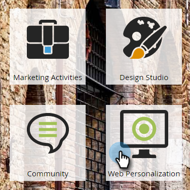

# Launch/Pause a Web Campaign {#launch-pause-a-web-campaign}

Launch/Pause a Web Campaign - Marketo Docs - Product Documentation

A web campaign is a customized reaction associated with a specific segment and can be a [dialog box](../../../../../welcome-to-marketo-docs/product-docs/web-personalization/working-with-web-campaigns/create-a-new-dialog-web-campaign.md) on your website, an [in zone replacement](../../../../../welcome-to-marketo-docs/product-docs/web-personalization/working-with-web-campaigns/create-a-new-in-zone-web-campaign.md), a widget feature, or an email alert.

You can launch or pause a web campaign in two ways from the Web Campaigns page or Set Web Campaigns page.

##### 1. Click Web Personalization. {#launch/pauseawebcampaign-clickwebpersonalization.}

##### 2. Go to Web Campaigns. {#launch/pauseawebcampaign-gotowebcampaigns.}

##### 3. If the campaign is launched, click Launched to change the campaign's status to Paused, to pause the campaign. {#launch/pauseawebcampaign-ifthecampaignislaunched-clicklaunchedtochangethecampaign'sstatustopaused-topausethecampaign.}

##### 4. If the campaign is paused, click Paused to change the campaign's status to Launched. This will activate and launch the campaign. {#launch/pauseawebcampaign-ifthecampaignispaused-clickpausedtochangethecampaign'sstatustolaunched.thiswillactivateandlaunchthecampaign.}

>[!NOTE]
>
>You can also change the campaign status in the Set Campaign Page.

##### 5. In the campaign, click Edit. {#launch/pauseawebcampaign-inthecampaign-clickedit.}

##### 6. Click Save to save and pause the campaign. Click Launch to launch and activate the campaign. {#launch/pauseawebcampaign-clicksavetosaveandpausethecampaign.clicklaunchtolaunchandactivatethecampaign.}

>[!NOTE]
>
>**Related Articles**
>
>* [Create a New Dialog Web Campaign](../../../../../welcome-to-marketo-docs/product-docs/web-personalization/working-with-web-campaigns/create-a-new-dialog-web-campaign.md)
>* [Create a New In Zone Web Campaign](../../../../../welcome-to-marketo-docs/product-docs/web-personalization/working-with-web-campaigns/create-a-new-in-zone-web-campaign.md)
>* [Create a Widget Web Campaign](../../../../../welcome-to-marketo-docs/product-docs/web-personalization/working-with-web-campaigns/create-a-new-widget-web-campaign.md)
>

