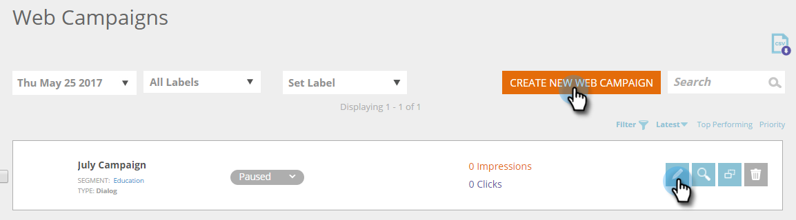
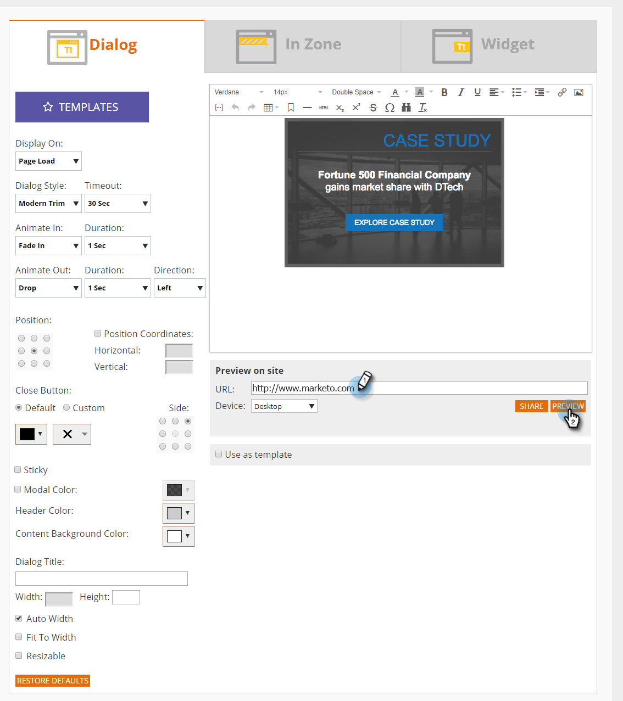
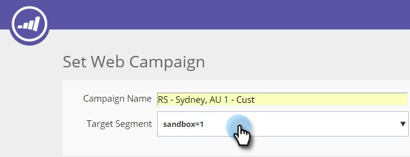

# Preview and Test a Web Campaign {#preview-and-test-a-web-campaign}

Preview and Test a Web Campaign - Marketo Docs - Product Documentation

This article shows you different ways to preview a web campaign, and also how to test it using a sandbox segment live on your website.

### What's in this article? {#what-s-in-this-article}

[Preview a Web Campaign on the Creation Page](#previewandtestawebcampaign-previewawebcampaignonthecreationpage)  
[Preview a Web Campaign on the Creation Page Using the Browser Plug-In](#previewandtestawebcampaign-previewawebcampaignonthecreationpageusingthebrowserplug-in)  
[Preview a Web Campaign on the Web Campaigns Page](#previewandtestawebcampaign-previewawebcampaignonthewebcampaignspage)  
[Preview a Web Campaign on your Website](#previewandtestawebcampaign-previewawebcampaignonyourwebsite)

#### Preview a Web Campaign on the Creation Page {#previewandtestawebcampaign-previewawebcampaignonthecreationpage}

##### 1. Go to Web Campaigns. {#previewandtestawebcampaign-gotowebcampaigns.}

##### 2. Click Create New Web Campaign or the icon to edit an existing campaign. {#previewandtestawebcampaign-clickcreatenewwebcampaignortheicontoeditanexistingcampaign.}

##### 3. In Preview on site, add the page URL and click Preview. A new window/tab opens showing the campaign preview. {#previewandtestawebcampaign-inpreviewonsite-addthepageurlandclickpreview.anewwindow/tabopensshowingthecampaignpreview.}

>[!TIP]
>
>Click **Share** to open an email with a fixed URL of the campaign preview.

>[!NOTE]
>
>You also have the option of installing a browser plug-in (either [Chrome](https://chrome.google.com/webstore/detail/marketo-web-personalizati/ldiddonjplchallbngbccbfdfeldohkj) or [Firefox](http://docs.marketo.com/display/docs/assets/mwp-0.0.0.8.xpi)) for the best experience previewing your campaign. See the section below.

`  
` 

#### Preview a Web Campaign on the Creation Page Using the Browser Plug-In {#previewandtestawebcampaign-previewawebcampaignonthecreationpageusingthebrowserplug-in}

##### 1. Follow steps 1 & 2 from the section above. {#previewandtestawebcampaign-followsteps1&2fromthesectionabove.}

##### 2. Click the link to the browser plug-in (in this case we're using Chrome). {#previewandtestawebcampaign-clickthelinktothebrowserplug-in(inthiscasewe'reusingchrome).}

##### 3. A new window/tab opens. Click Add to Chrome. {#previewandtestawebcampaign-anewwindow/tabopens.clickaddtochrome.}

##### 4. Click Add Extension. {#previewandtestawebcampaign-clickaddextension.}

##### 5. Go back to Marketo. Add the page URL and click Preview.  {#previewandtestawebcampaign-gobacktomarketo.addthepageurlandclickpreview.}

##### 6. A new window/tab opens which allows you to preview how your campaign looks on a desktop, phone, or tablet. {#previewandtestawebcampaign-anewwindow/tabopenswhichallowsyoutopreviewhowyourcampaignlooksonadesktop-phone-ortablet.}

#### Preview a Web Campaign on the Web Campaigns Page {#previewandtestawebcampaign-previewawebcampaignonthewebcampaignspage}

##### 1. While looking at the listing of your web campaigns, simply choose a campaign and click the Preview icon. {#previewandtestawebcampaign-whilelookingatthelistingofyourwebcampaigns-simplychooseacampaignandclickthepreviewicon.}

Easy!

#### Preview a Web Campaign on your Website {#previewandtestawebcampaign-previewawebcampaignonyourwebsite}

Create a sandbox segment and campaign.

##### 1. Go to Segments. {#previewandtestawebcampaign-gotosegments.}

##### 2. Click Create New.  {#previewandtestawebcampaign-clickcreatenew.}

##### 3. Name the segment.  {#previewandtestawebcampaign-namethesegment.}

##### 4. Under Behavioral, drag Include Pages onto the canvas. Add the value &#42;sandbox=1&#42;. Click Save & Define Campaign. {#previewandtestawebcampaign-underbehavioral-dragincludepagesontothecanvas.addthevalue*sandbox=1*.clicksave&definecampaign.}

##### 5. On the Set Web Campaign page, change the Target Segmentto the sandbox segment by selecting it from the list. {#previewandtestawebcampaign-onthesetwebcampaignpage-changethetargetsegmenttothesandboxsegmentbyselectingitfromthelist.}

##### 6. Complete the campaign creative and Click Launch.  

{#previewandtestawebcampaign-completethecampaigncreativeandclicklaunch.}

##### 7. Go to your website, add the URL parameter "?sandbox=1" at the end of the URL. Example: [www.marketo.com?sandbox=1](http://www.marketo.com/?sandbox=1) {#previewandtestawebcampaign-gotoyourwebsite-addtheurlparameter"?sandbox=1"attheendoftheurl.example-www.marketo.com?sandbox=1}

##### 8. See the campaign react on your website.  {#previewandtestawebcampaign-seethecampaignreactonyourwebsite.}

>[!NOTE]
>
>`C` `ampaigns react only once during a visitor session. To see the campaign again, clear your browser cookies.`

>[!NOTE]
>
>Redirect campaigns cannot be previewed. The only way to test them is by using a sandbox segment (that targets by specific pages - &#42;sandbox=redirect&#42; )

