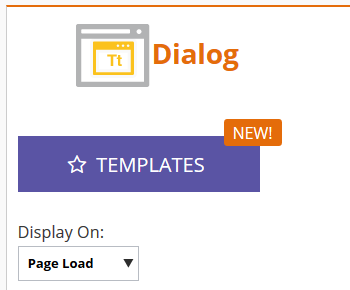
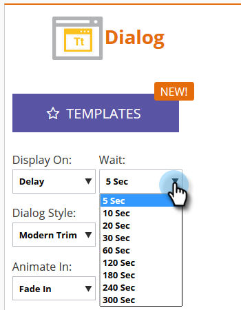

# Set How Your Web Campaign Displays {#set-how-your-web-campaign-displays}

Set How Your Web Campaign Displays - Marketo Docs - Product Documentation

There are several methods to utilize when it comes to when/how your web campaign displays.

### What's in this article? {#what-s-in-this-article}

[Page Load](#sethowyourwebcampaigndisplays-pageload)  
[Delay](#sethowyourwebcampaigndisplays-delay)  
[Scroll](#sethowyourwebcampaigndisplays-scroll)  
[Exit Intent](#sethowyourwebcampaigndisplays-exitintent)

#### Page Load {#sethowyourwebcampaigndisplays-pageload}

Selected by default, this choice simply displays the campaign upon page load.

#### Delay {#sethowyourwebcampaigndisplays-delay}

Specify a time delay (in total seconds) for web campaigns to react on your website.

##### 1. Click the Display On drop-down and select Delay. {#sethowyourwebcampaigndisplays-clickthedisplayondrop-downandselectdelay.}

##### 2. Click the Wait drop-down and select the desired amount of time. {#sethowyourwebcampaigndisplays-clickthewaitdrop-downandselectthedesiredamountoftime.}

#### Scroll {#sethowyourwebcampaigndisplays-scroll}

##### 1. Click the Display On drop-down and select Scroll. {#sethowyourwebcampaigndisplays-clickthedisplayondrop-downandselectscroll.}

##### 2. Click the When drop-down and select when you want your web campaign to display. {#sethowyourwebcampaigndisplays-clickthewhendrop-downandselectwhenyouwantyourwebcampaigntodisplay.}

<table class="confluenceTable"> 
 <tbody> 
  <tr> 
   <td><strong>Below fold</strong></td> 
   <td>Displays campaign when visitor scrolls below the fold. Campaign disappears when visitor scrolls back above the fold.</td> 
  </tr> 
  <tr> 
   <td><strong>Percent</strong></td> 
   <td>Displays campaign when visitor scrolls to predetermined percentage of the page.</td> 
  </tr> 
  <tr> 
   <td><strong>Pixel</strong></td> 
   <td>
Displays campaign when visitor scrolls to predesignated top pixel on the page.
</td> 
  </tr> 
 </tbody> 
</table>

#### Exit Intent {#sethowyourwebcampaigndisplays-exitintent}

Exit intent will display the web campaign upon mouse cursor exit of the browser.

##### 1. Click the Display On drop-down and select Exit Intent. {#sethowyourwebcampaigndisplays-clickthedisplayondrop-downandselectexitintent.}

##### 2. A message appears reminding you Exit Intent is not compatible with mobile. {#sethowyourwebcampaigndisplays-amessageappearsremindingyouexitintentisnotcompatiblewithmobile.}

>[!TIP]
>
>Wanna see how your chosen effects will look ahead of time? Check them out via an [Web Campaign Preview](preview-and-test-a-web-campaign.md).

