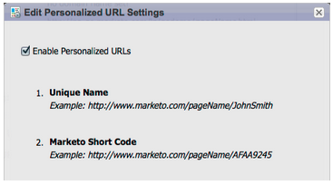

# Release Notes: Jan/Feb 2012 {#release-notes-jan-feb}

Release Notes: Jan/Feb 2012 - Marketo Docs - Product Documentation

`The following features are included in the Jan/Feb Release. Check your Marketo edition for feature availability. Come back after the release for links to detailed feature documentation.`   `  
` 

### What's in this article? {#what-s-in-this-article}

[Advanced Dynamic Content](#releasenotes-jan/feb2012-advanceddynamiccontent)  
[Segmentation](#releasenotes-jan/feb2012-segmentation)  
[Snippets](#releasenotes-jan/feb2012-snippets)  
[PURLs](#releasenotes-jan/feb2012-purls)  
[EU Privacy Directive Support](#releasenotes-jan/feb2012-euprivacydirectivesupport)  
[Single Sign-on](#releasenotes-jan/feb2012-singlesign-on)  
[Updated Email and Landing Page Editors](#releasenotes-jan/feb2012-updatedemailandlandingpageeditors)  
[Browser Support](#releasenotes-jan/feb2012-browsersupport)  
[Program Management](#releasenotes-jan/feb2012-programmanagement)  
[Unsubscribe from Subscription Report](#releasenotes-jan/feb2012-unsubscribefromsubscriptionreport)  
[Munchkin Updates](#releasenotes-jan/feb2012-munchkinupdates)  
[Program Opportunity Analysis (RCA only)](#releasenotes-jan/feb2012-programopportunityanalysis(rcaonly))  
[Program Revenue Stage Analysis](#releasenotes-jan/feb2012-programrevenuestageanalysis)

>[!NOTE]
>
>**Deep Dive**
>
>For other releases, see the [Release Notes](../../../../welcome-to-marketo-docs/release-notes.md) deep dive.

#### Advanced Dynamic Content {#releasenotes-jan/feb2012-advanceddynamiccontent}

*Available for Pro and Enterprise Versions*

With advanced dynamic content you can create engaging email communications and landing pages relevant to your audience without having to create multiple assets for the same message. Upgraded Previewers allow you to view each unique version in a single screen.

#### Segmentation  {#releasenotes-jan/feb2012-segmentation}

*Available for Pro and Enterprise Versions*

Segmentation is a group of segments, which are a targeted group of individuals to whom you market. Segments are defined by rules that are driven by filter criteria similar to smart lists. Your segments can be based on demographic data, such as job title or industry, or based on behaviors such as web pages visited or clicked links.

#### Snippets {#releasenotes-jan/feb2012-snippets}

*Available for Pro and Enterprise Versions*

Store rich content that can be used over and over again to create static or dynamic emails and landing pages.

#### PURLs {#releasenotes-jan/feb2012-purls}

*Available for Pro and Enterprise Versions*

Using Personalized URLs (PURLs) marketers can now create contact-specific URLs, to drive personalization, measurability and lift responses in multi-touch marketing programs for both direct mail and email campaigns.

#### EU Privacy Directive Support {#releasenotes-jan/feb2012-euprivacydirectivesupport}

New features to respect browser “Do Not Track” settings include the ability to disable tracking for anonymous leads; this makes complying with the EU's stricter privacy tracking regulations easier.

#### Single Sign-on {#releasenotes-jan/feb2012-singlesign-on}

Organizations now have the ability to support a seamless login to the Marketo application using SAML 2.0 for single sign-on from a corporate portal.

#### Updated Email and Landing Page Editors {#releasenotes-jan/feb2012-updatedemailandlandingpageeditors}

The Email and Landing Page Editors were redesigned with a more inviting interface, intuitive navigation and a dramatically improved user experience, this includes:

A side-by-side HTML and text view

The From Name, From Email, Reply-To (NEW) and Subject are displayed in the editor. All other settings are accessible through the Edit Settings button.

#### Browser Support {#releasenotes-jan/feb2012-browsersupport}

* Mozilla Firefox 9.0
* Google Chrome 16
* Microsoft Internet Explorer 8 & 9
* **Note**: we no longer support Internet Explorer 7

#### Program Management {#releasenotes-jan/feb2012-programmanagement}

Simplified program management improves usability with Token delete and the easier deletion of Programs.

#### Unsubscribe from Subscription Report {#releasenotes-jan/feb2012-unsubscribefromsubscriptionreport}

Now you can unsubscribe from the subscription directly from the report!

#### Munchkin Updates {#releasenotes-jan/feb2012-munchkinupdates}

New Munchkin calls reduce webpage load times and provide more consistent performance for click link events.

#### Program Opportunity Analysis (RCA only) {#releasenotes-jan/feb2012-programopportunityanalysis(rcaonly)}

Understand marketing contribution to individual opportunity revenue

#### Program Revenue Stage Analysis {#releasenotes-jan/feb2012-programrevenuestageanalysis}

Gain insight into program lead velocity by understanding which programs acquired the fast movers

