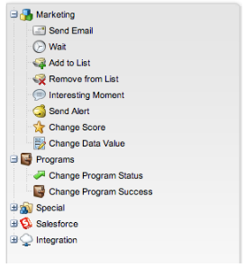

# Release Notes: May 2013 {#release-notes-may}

Release Notes: May 2013 - Marketo Docs - Product Documentation

The following features are included in the May release. Please check your [Marketo](http://docs.marketo.com/display/docs/assets/pricing.php) [Edition](http://docs.marketo.com/display/docs/assets/pricing.php) for feature availability.

After the release, be sure to check out the [New Release](release-notes-december-2013.md) tab in the Community for detailed Knowledge Base articles for each feature!

### What's in this article? {#what-s-in-this-article}

[Calendar Files for Landing Pages](#releasenotes-may2013-calendarfilesforlandingpages)  
[Model Membership Tab](#releasenotes-may2013-modelmembershiptab)  
[Reorganized Flow Action Tree](#releasenotes-may2013-reorganizedflowactiontree)  
[Renamed Flow Actions](#releasenotes-may2013-renamedflowactions)

#### Calendar Files for Landing Pages {#releasenotes-may2013-calendarfilesforlandingpages}

Create a calendar file as a My Token that can be added to your landing page. This integrated calendar file (e.g. .ics file) will render all tokens, including My Tokens on local asset landing pages.

#### Model Membership Tab {#releasenotes-may2013-modelmembershiptab}

View all your model member's data in one place in order to easily monitor and troubleshoot. The new Members Tab is a read-only view available when you select an approved Revenue Cycle Model.

#### Reorganized Flow Action Tree {#releasenotes-may2013-reorganizedflowactiontree}

Find flow actions faster with the newly reorganized flow action tree.

#### Renamed Flow Actions {#releasenotes-may2013-renamedflowactions}

Change Progression Status is now Change Program Status. Change Program Data is now Change Program Success

