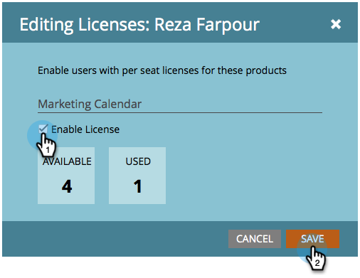
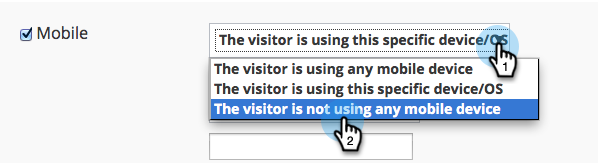

# Release Notes: August 2014 {#release-notes-august}

Release Notes: August 2014 - Marketo Docs - Product Documentation

The following features are included in the August 2014 Release. Check your Marketo edition for feature availability. Come back after the release for links to detailed feature documentation.

### What's in this article? {#what-s-in-this-article}

[Marketing Calendar Licenses](#releasenotes-august2014-marketingcalendarlicenses)  
[New User Permissions](#releasenotes-august2014-newuserpermissions)  
[Export Users and Roles from Admin](#releasenotes-august2014-exportusersandrolesfromadmin)  
[Delete Channels and Tags](#releasenotes-august2014-deletechannelsandtags)  
[Automated DKIM](#releasenotes-august2014-automateddkim)  
[Real-Time Personalization Updates](#releasenotes-august2014-real-timepersonalizationupdates)  
[Mobile Targeting](#releasenotes-august2014-mobiletargeting)  
[Enhanced 1:1 Segmentation and Targeting](#releasenotes-august2014-enhanced1-1segmentationandtargeting)  
[Campaign Sharing](#releasenotes-august2014-campaignsharing)  
[Content Recommendation Engine Report](#releasenotes-august2014-contentrecommendationenginereport)  
[Enhanced User Administration](#releasenotes-august2014-enhanceduseradministration)  
[Tracking Control](#releasenotes-august2014-trackingcontrol)

#### Marketing Calendar Licenses {#releasenotes-august2014-marketingcalendarlicenses}

After September 5th, 2014 only 5 users can have free access to the marketing calendar. Be sure to [Issue/Revoke a Marketing Calendar License](../../../welcome-to-marketo-docs/product-docs/core-marketo-concepts/marketing-calendar/understanding-the-calendar/issue/revoke-a-marketing-calendar-license.md) to the users of your choice before then for un-interrupted access.

#### New User Permissions {#releasenotes-august2014-newuserpermissions}

The following new user permissions were added:

| `Permission` | `Description` |
|---|---|
| `Access Revenue Explorer` | `If you purchased RCA, you will now have control over who can access it.` |
| `Import List` | `Restrict users from importing lists into the lead database.` |
| `List Import` | `Restrict users from importing lists via a program under marketing activities.` |
| `Activate Trigger Campaign` | `Control who can and cannot activate trigger campaigns.` |
| `Schedule Batch Campaign` | `Control who can and cannot schedule batch campaign runs.` |

#### Export Users and Roles from Admin {#releasenotes-august2014-exportusersandrolesfromadmin}

You can now [Export a List of Users and Roles](../../../welcome-to-marketo-docs/product-docs/administration/users-and-roles/export-a-list-of-users-and-roles.md) from Marketo. You can also include a "Last Login" time stamp to be included with the export.

#### Delete Channels and Tags {#releasenotes-august2014-deletechannelsandtags}

You can now delete any unused channels and statuses. As always, you can only hide one that is currently in use.

#### Automated DKIM {#releasenotes-august2014-automateddkim}

For improved deliverability, all outgoing emails will be DKIM (DomainKeys Identified Mail) signed. By default, emails will use Marketo's shared DKIM signature. You will have the option to customize this signature.

>[!NOTE]
>
>DKIM will be rolled out slowly, you may not see it for a few weeks.

#### Real-Time Personalization Updates {#releasenotes-august2014-real-timepersonalizationupdates}

`We have added` `labels` `to the campaign page so that you can tag to your hearts content.`

#### Mobile Targeting {#releasenotes-august2014-mobiletargeting}

You asked on the community and we delivered! You can now include, exclude or set a specific call to action for mobile and tablet users.

#### Enhanced 1:1 Segmentation and Targeting {#releasenotes-august2014-enhanced1-1segmentationandtargeting}

You can now use advanced filter operators for targeting known visitors.

#### Campaign Sharing {#releasenotes-august2014-campaignsharing}

You now have the ability to quickly and easily share an RTP campaign preview link.

#### Content Recommendation Engine Report {#releasenotes-august2014-contentrecommendationenginereport}

We have added a new content recommendation engine report for you to see a nice summary.

#### Enhanced User Administration {#releasenotes-august2014-enhanceduseradministration}

Admin users can now lock users due to multiple failed login attempts. You can also unlock those users if desired.

#### Tracking Control {#releasenotes-august2014-trackingcontrol}

You can now exclude specific IPs from all tracking and reporting in Real-Time Personalization.

