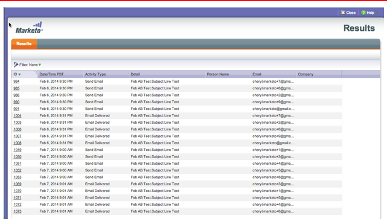
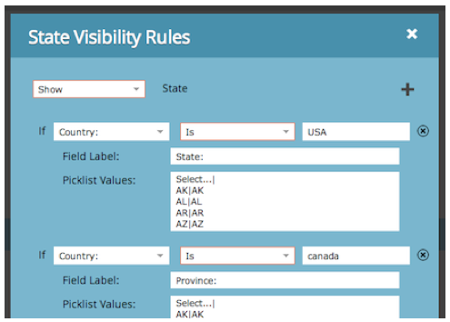

# Release Notes: February 2014 {#release-notes-february}

Release Notes: February 2014 - Marketo Docs - Product Documentation

The following features are included in the February 2014 release. Please check your Marketo Edition for feature availability. After the release, be sure to come back to find links to detailed Knowledge Base articles for each feature!

>[!NOTE]
>
>[Engagement Score as Winning Criteria](#releasenotes-february2014-engagementscoreaswinningcriteria)  
>[Email Program Results Tab](#releasenotes-february2014-emailprogramresultstab)  
>[People/Leads Blocked from Mailing](#releasenotes-february2014-people/leadsblockedfrommailing)  
>[Export Email Program Data](#releasenotes-february2014-exportemailprogramdata)  
>[Engagement Score in Engagement Stream Performance Report](#releasenotes-february2014-engagementscoreinengagementstreamperformancereport)  
>[Program Details in Email Analysis](#releasenotes-february2014-programdetailsinemailanalysis)  
>[Update to Clicks Link Filters and Trigger](#releasenotes-february2014-updatetoclickslinkfiltersandtrigger)  
>[Forms 2.0 Enhancements](#releasenotes-february2014-forms2.0enhancements)

#### Engagement Score as Winning Criteria {#releasenotes-february2014-engagementscoreaswinningcriteria}

[Use the engagement score](../../../welcome-to-marketo-docs/product-docs/email-marketing/email-programs/email-program-actions/email-test---a/b-test/define-the-a/b-test-winner-criteria.md) to determine the winning variant in your A/B split test or Champion/Challenger test. The test must run for a minimum of 24 hours, to give an adequate engagement score.

#### Email Program Results Tab {#releasenotes-february2014-emailprogramresultstab}

[View the results](../../../welcome-to-marketo-docs/product-docs/email-marketing/email-programs/email-program-data/view-email-program-results.md) and activities logged for the email program.

#### People/Leads Blocked from Mailing {#releasenotes-february2014-people/leadsblockedfrommailing}

[Click the people/leads blocked from mailing](../../../welcome-to-marketo-docs/product-docs/email-marketing/email-programs/managing-people-in-email-programs/define-an-audience-with-a-smart-list.md) number to see who will not receive the email due to being unsubscribed, black listed, having an invalid or blank email address, or being marketing suspended.

#### Export Email Program Data {#releasenotes-february2014-exportemailprogramdata}

[Export email metrics to Excel](../../../welcome-to-marketo-docs/product-docs/email-marketing/email-programs/email-program-data/export-email-program-dashboard-to-excel.md), including AB Test variant data.

#### Engagement Score in Engagement Stream Performance Report {#releasenotes-february2014-engagementscoreinengagementstreamperformancereport}

We added the Engagement Score to the [Engagement Stream Performance Report](../../../welcome-to-marketo-docs/product-docs/email-marketing/drip-nurturing/reports-and-notifications/engagement-stream-performance-report.md) to help you see how effective the content in your engagement program is.

#### Program Details in Email Analysis {#releasenotes-february2014-programdetailsinemailanalysis}

[Now you can group your email metrics by Program Name, Channel and Tags](../../../welcome-to-marketo-docs/product-docs/reporting/revenue-cycle-analytics/email-analysis/build-an-email-analysis-report-that-shows-program-information.md). The program name is added to the Email Name field when the email is a local asset to the Program. The new Program Name field shows the program name of the smart campaign that sent the email. This could be different from the program in the Email Name field if the email is a local asset of a different program.

#### Update to Clicks Link Filters and Trigger {#releasenotes-february2014-updatetoclickslinkfiltersandtrigger}

The following filter and trigger names have been updated:

* Clicks Link to Clicks Link on Web Page
* Clicked Link to Clicked Link on Web Page
* Not Clicked Link to Not Clicked Link on Web Page

#### Forms 2.0 Enhancements {#releasenotes-february2014-forms2.0enhancements}

We’ve given Forms 2.0 several “quality of life” updates with this release. In addition to enabling progressive profiling on embedded forms, we’ve made workflow and UX changes that will make it easier to use the more advanced functionality in the editor, [including the visibility rules](../../../welcome-to-marketo-docs/product-docs/demand-generation/forms/form-fields/dynamically-toggle-visibility-of-a-form-field.md), advanced thank you pages, and hidden fields.

